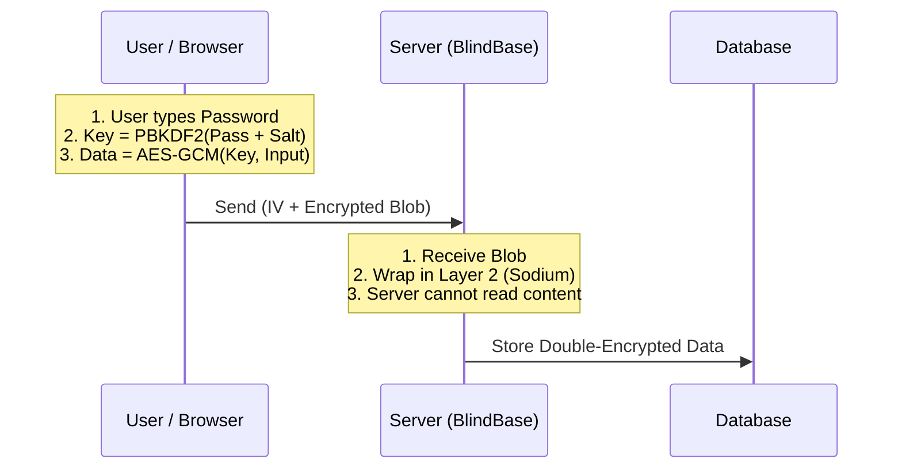

# BlindBase

**BlindBase** is a lightweight, zero-knowledge encryption framework designed for personal applications.

It operates on a "Trust No One" (TNO) architecture: data is encrypted in the browser using a key derived from the user's password. The server acts only as a blind storage vault, applying a second layer of encryption for data-at-rest security, but never possessing the ability to read the actual content.

## 🚀 Features

* **Zero-Knowledge Privacy:** The decryption key exists *only* in the user's RAM. It is never sent to the server.
* **Two-Layer Defense:**
    1.  **Layer 1 (Client):** AES-256-GCM encryption (Key derived via PBKDF2-SHA256, 600,000 iterations).
    2.  **Layer 2 (Server):** Sodium/ChaCha20 encryption (Server-side secret).
* **Authenticated Access:** PBKDF2 yields 512 bits, split into an encryption key (never transmitted) and an independent auth token. The server verifies a hash of the auth token before any read or write, so only the password holder can read or overwrite a vault — while the server still cannot decrypt the contents.
* **Dependency-Free:** The client SDK is pure Vanilla JS using the native Web Crypto API. No NPM bloat.
* **Data Agnostic:** Securely store text, JSON, or binary blobs.
* **Simple Stack:** Designed for modern Browsers and PHP 8.1+ environments.

## 🛠 Architecture




## 📦 Installation

### 1. Server-Side (PHP)

BlindBase requires PHP 8.1+ with the `sodium` extension enabled.

1. Copy `BlindBase.php` (or your API handler) to your server.
2. Set your server-side secret key in your environment variables:
```bash
export BLINDBASE_SECRET="your_hex_encoded_32_byte_key"

```


*(Generate one using `php -r "echo bin2hex(sodium_crypto_secretbox_keygen());"`)*

### 2. Client-Side

Include the `BlindBase` class in your project. No build tools required.

```html
<script src="js/BlindBase.js"></script>

```

## 💻 Usage Example

### Initialize & Login

Before reading or writing, the user must derive their session key.

```javascript
const vault = new BlindBase();

// 1. Fetch user's unique salt from server
const salt = await fetch('/api?action=get_salt&user=alice').then(r => r.json());

// 2. Derive key (cpu intensive)
await vault.login("my-super-secret-password", salt);

```

### Writing Data

```javascript
const secretDiary = {
    date: "2026-01-23",
    text: "I launched BlindBase today."
};

// Encrypts locally -> Sends to server
await vault.save(secretDiary);

```

### Reading Data

```javascript
// Downloads blob -> Decrypts locally
try {
    const data = await vault.load();
    console.log("Decrypted:", data);
} catch (e) {
    console.error("Decryption failed. Wrong password?");
}

```

## ⚠️ Security Trade-offs

By using BlindBase, you accept specific trade-offs inherent to Zero-Knowledge architectures:

1. **NO Password Reset:** If a user loses their password, **the data is lost forever**. The server cannot restore it.
2. **XSS Sensitivity:** Because the key lives in JavaScript memory, your application is vulnerable to Cross-Site Scripting (XSS). Ensure you use strict Content Security Policy (CSP) headers.
3. **Search limitations:** The server cannot query the data (e.g., `SELECT * WHERE text LIKE '%hello%'`). All filtering must happen client-side after decryption.
4. **TLS is mandatory:** The auth token is a bearer credential (it authorizes reads and overwrites, though not decryption). Always serve BlindBase over HTTPS so it cannot be intercepted.
5. **Non-rotatable secret:** Per-user salts are derived from `BLINDBASE_SECRET`. Changing or losing the secret changes every salt and renders **all existing vaults unrecoverable**.

## ⚙️ Deployment Notes

* **Protect the storage directory.** The bundled `storage/.htaccess` blocks direct web access **on Apache only**. If you deploy behind nginx, Caddy, or another server, replicate that denial yourself (e.g. deny requests to `/storage/`), or place the storage directory outside the web root via `BLINDBASE_STORAGE_PATH`.
* **Restrict CORS.** Leave `BLINDBASE_ALLOWED_ORIGINS` unset for same-origin deployments; set it explicitly only when a different browser origin must call the API.

## 📄 License

MIT License
